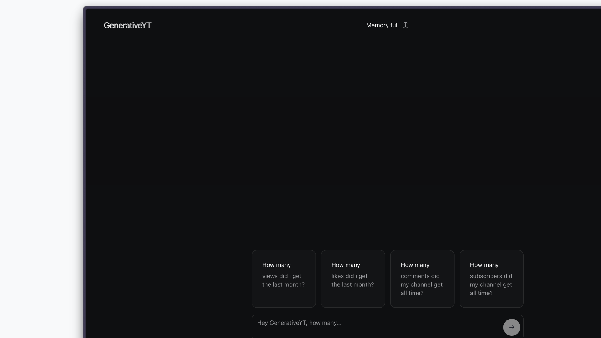

<p align="center">
  <br/>
  <a href="https://generative-yt.vercel.app">
    
  </a>
  <br/>
  <h1>GenerativeYT</h1>
  <p>Your AI-powered assistant for optimizing your YouTube channel with advanced analytics and actionable insights.</p>
</p>

## 🚀 Overview

GenerativeYT use Vercel's AI SDK and various modern tools, this app provides real-time insights and personalized recommendations to improve your content strategy and channel performance.

## 🎥 Preview

<video controls src="public/assets/demo.mp4" title="Demo"></video>



Explore the live demo of GenerativeYT at: **[generative-yt.vercel.app](https://generative-yt.vercel.app)**

## 🛠️ Tech Stack

- **Next.js 14**: Utilizes Next.js 14 with the App Router for efficient and modern routing.
- **Supabase**: Handles authentication via Google OAuth Provider for secure user management.
- **YouTube Analytics API**: Integrates with YouTube to fetch and analyze your channel’s data.(only read and no danger info like revenue)
- **OpenAI GPT-4o-mini**: Powers intelligent, contextual responses within the chat interface.
- **Vercel AI SDK**: Manages the generative UI, AI state management, hooks, and model connections.
- **Shadcn UI & Tailwind CSS**: Provides a clean, responsive, and aesthetically pleasing user interface.

## 🤝 Contributing

We welcome contributions from the community. If you’d like to contribute, please follow these steps:

- **Fork the repository**

- **Create a new branch**:

```bash
git checkout -b feature/your-feature
````

- **Commit your changes**

```bash
git commit -am 'Add new feature'
```

- **Push to the branch**

```bash
git push origin feature/your-feature
```

- **Create a new Pull Request**

## 📑 License

This project is licensed under the MIT License.